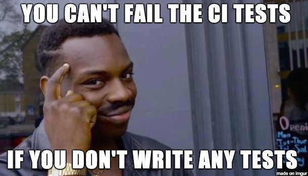

# Apresentação Integração Contínua

# Por que integrar?

> *"...Works on my machine..."* algum desenvolvedor em uma empresa não muito distante

* compartilhando informações
* refazendo perdas
* remoto

# Controle de Versão

## "This thing called GIT"

* Segundo [**Raphael Lacerda**](https://github.com/raphaelLacerda/apresentacao-git)

# Ambiente de Integração (AIC)

## Construindo seu código

## Analisando melhor o serviço de integração

## Integração funciona com qualquer linguagem

# E o Deploy, como fica?

# Git basics

## Exercício: criando nosso repositório local Git

1. abra o terminal
2. crie uma pasta para seu repositório => mkdir snr-(sua matricula)
3. git init
4. git	config	--global	user.name	""
5. git	config	--global	user.email	""
6. git config -l
7. touch hello.txt
8. Abra o arquivo e escreva algo => gedit hello.txt

## Entendendo o RTC

* Precisamos abrir um tarefa, pois nosso commit precisa estar vinculado a ela.

## Exercício - Fazendo commits

1. git add .
2. git commit -am "task (numero da sua tarefa) - meu primeiro commit"
3. git log

# Selfie

## Exercício - criando repo remoto

1. Entre no https://alm.intranet.bb.com.br/selfie
2. Criar repositório
3. Sigla SNR
4. nome do repo deve ser snr-(sua matricula) ex: snr-f8437296
5. copie o endereço gerado: http://git.intranet.bb.com.br:8113/gitrepos/snr-f8437296.git

## Exercício - linkando nosso repositório local com repositório remoto

1. Abra o terminal e entre na pasta do seu repositório criado anteriormente
2. git remote -v => este comando lista todos os repositório remotos
3. git remote add origin http://git.intranet.bb.com.br:8113/gitrepos/snr-f8437296.git

## Exercício - pushando para o remote

1. git push origin master

# Corrigindo bugs e Forks

## Exercício - clonando projetos e fazendo alterações

* Agora vamos pegar um projeto já pronto e consertá-lo localmente
1. Abra o terminal e vá para sua home => cd ~
2. git clone http://git.intranet.bb.com.br:8113/gitrepos/snr-template-java.git
3. mvn clean install

* Calma não vai funcionar mesmo

4. abra o sistema de arquivos e copie todos os arquivos desta pasta para a pasta onde está o seu repositório
5. gedit pom.xml ==> altere o artifactId para snr-f8437296
6. mvn clean install

* Calma não vai funcionar novamente

# E os testes?

* Apresentação [**TDD**](https://github.com/raphaelLacerda/apresentacao-tdd/blob/master/index.html)

## Exercício - codificando meu primeiro teste

1. Pelo sistema de arquivo, ache a classe src/main/java/br/com/bb/snr/modelo/Calculadora.java
e a classe src/test/java/br/com/bb/snr/modelo/Calculadora.java

2. Abra os dois com o gedit

* Perceba quando tentamos fazer o build da nossa aplicação, um teste falha, vc precisa consertá-lo.

3. Faça a subtração no Calculadora.java
4. Faça a asserção no CalculadoraTest.java
5. mvn clean install

## Exercício - mandando alterações para o meu repositório

1. git add .
2. git commit -am "task 12313 - adicionando subtracao na calculadora"
3. git push origin master

* Agora precisamos buildar nosso projeto no servidor de integração Contínua

## Exercício - buildando nossa app a partir do Selfie

1. Entre em https://alm.intranet.bb.com.br/selfie
2. Clique em projeto de build
3. Escolha a sigla SNR
4. Escolha o seu repositório
5. informe o nome do componente: snr-f8437296
6. Escolha o template JAVA

* Pronto, seu projeto de build está terminado! Agora é só buildar!

7. Vá no HOME do selfie
8. Em disparar o build, informe o nome do componente e a branch (master)
9. Solicite o build e aguarde o log

* O log não será encontrado no começo, mas mantenha esse link e faça a requisição depois.

# Outras integrações

# Saiba mais

* [**Selfie**](http://alm.intranet.bb.com.br/selfie)
* [**ALM**](http://alm.intranet.bb.com.br)
* [**Portal Devops**](http://devops.intranet.bb.com.br/index.php)
* [**Sonar**](http://sonar.intranet.bb.com.br)
* [**Artifactory**](http://atf.intranet.bb.com.br)

